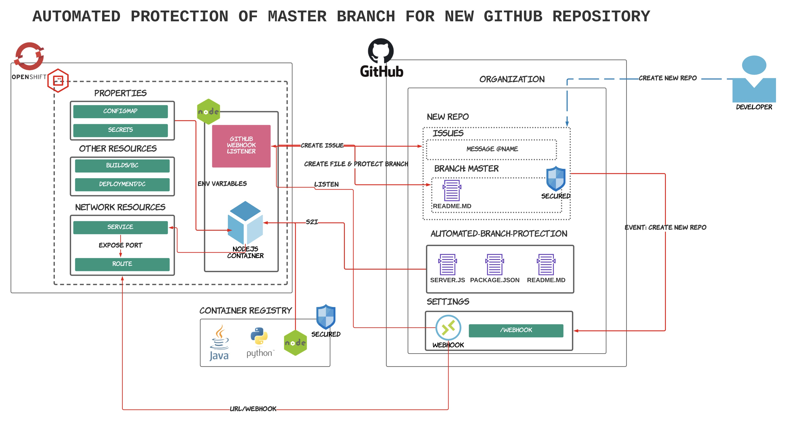
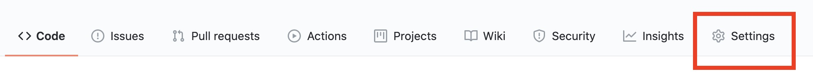
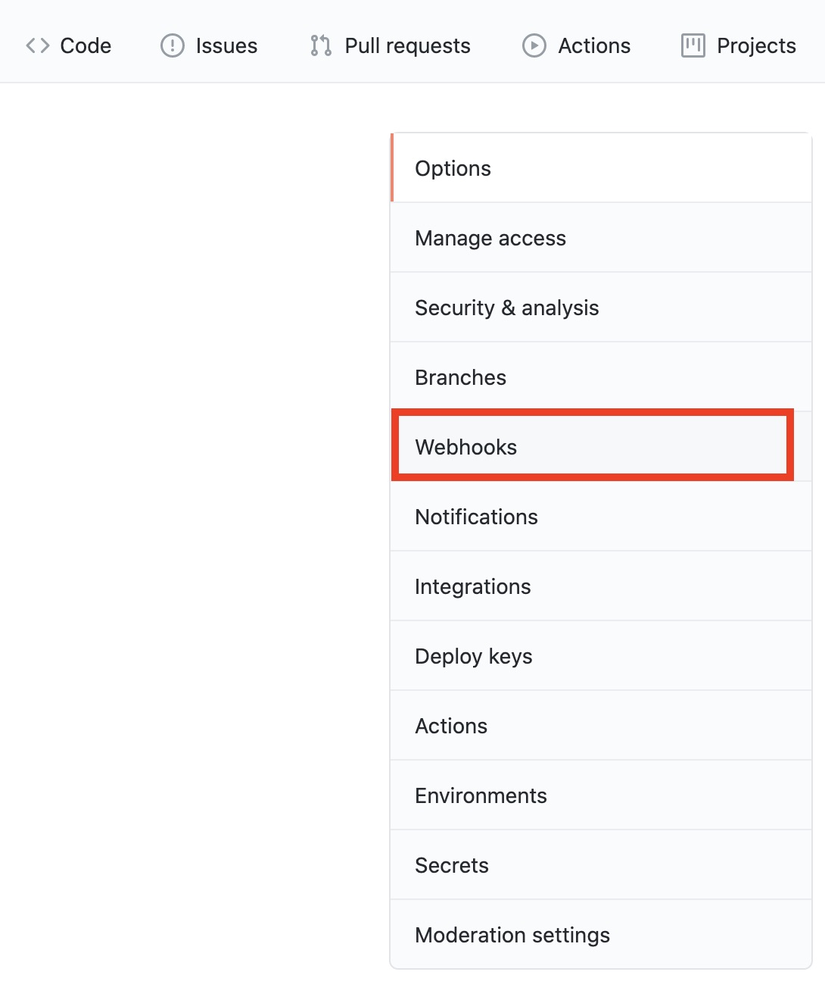
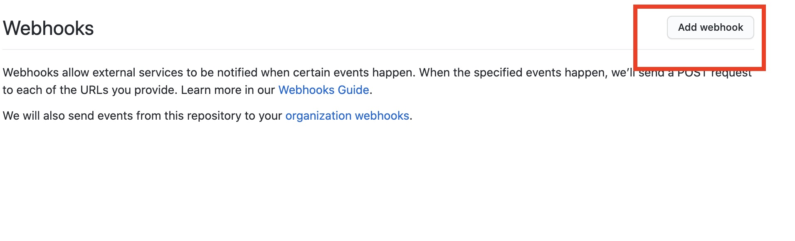
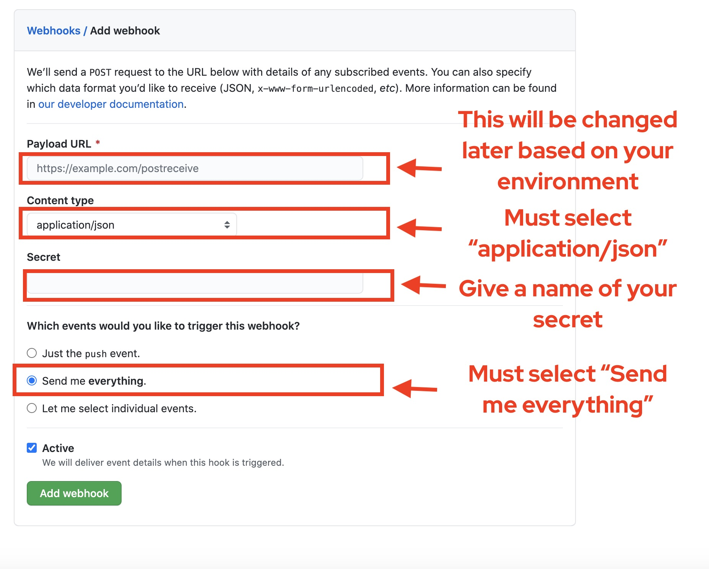

# Automated Protection of a Main Branch Upon New GitHub Repository 



This repository contains a solution that automates the protection of a main branch for a new GitHub repository by exploring powerful GitHub APIs, webhook, and a simple NodeJS webservice.

## Features

- Provide a simple NodeJS webservice built with powerful GitHub APIs, GitHub Oktokit libraries, and webhook
- Automatically protect a main branch (default: master) upon creating a new repository
- Deploy under a Kubernetes platform like Red Hat Openshift to provide the easy deployment and scalability
- Create an issue and notify an user with **@TAG_NAME** mechanism
- Create a sample README.md file under **master** branch
- Automatically protect the **master** branch 

## What are in this repo

| File Name | What It Is |
| ------- | ------------ |
| app | Directory containing the actual files to run NodeJS based application |
| app/server.js | Main NodeJS file that runs the application and listen to GitHub webhook  |
| app/package.json | Install and manage the packages like  "@octokit/webhooks" and  "@octokit/core" |
| app/package-lock.json | Describes the exact tree that was generated, such that subsequent installs are able to generate identical trees, regardless of intermediate dependency updates. [See package-lock.json](https://docs.npmjs.com/cli/v6/configuring-npm/package-lock-json) |
| docs | Directory containing the supplementary documentation files |
| docs/FAQ.md | Contains some commonly asked questions and answers |
| images | Directory that contains image files to be referenced throughout documentation |
| .gitignore | Prevents an uncessary files to be checked into the repo |
| LICENSE | MIT License |
| README.md | This file that you are reaading :) | 
| CONTRIBUTING.md | Guide on how to contribute to the repo |


## PreRequisites

Due to the security concerns and reusability, the environment variables will be used to populate the necessary values. These values are shown under [required-environment.env](./required-environment.env) and should set accordingly based on the environments you are running. In the [app/server.js](./app/server.js), these will be references as **process.env.${ENVIRONMENT_VARIABLE}**.

| Environment Variable | What It Is | Required? | Default |
| ------- | ------------ | -------- | ----- |
| PERSONAL_TOKEN | Personal access tokens (PATs) are an alternative to using passwords for authentication to GitHub. [See Personal Access Token]((https://docs.github.com/en/free-pro-team@latest/github/authenticating-to-github/creating-a-personal-access-token).) | Yes | None |
| GITHUB_WEBHOOK_SECRET | Webhook secret has to be created under your organization. [See Webhook](https://docs.github.com/en/free-pro-team@latest/developers/webhooks-and-events/securing-your-webhooks) | Yes | None |
| ORGANIZATION | New organization that hosts this application and also your new repos | Yes | None |
| TAG_NAME | GitHub User ID to notify the creation of a new repo through an issue | Yes | None |
| CONTENT_FILE | Base64 encoded content for main README.MD file. [See FAQ section](docs/FAQ.md) | No but highly recommended | "Get Started" in BASE64 Encoded |
| USER_AGENT | Defines the name of the application. [See User Agent](https://docs.github.com/en/free-pro-team@latest/rest/overview/resources-in-the-rest-api#user-agent-required) | No but recommended | "myApp v.1.2.3" |
| TIME_ZONE | Some requests that create new data, such as creating a new commit, allow you to provide time zone information when specifying or generating timestamps. Default is set to [See Time Zone](https://docs.github.com/en/free-pro-team@latest/rest/overview/resources-in-the-rest-api#timezones) | No but recommended | "America/Chicago" |
| PROTECTING_BRANCH | Branch to protect when a new repo is created | No | master |
| COMMITTER_NAME | Name of a commiter | No | "Anonymous" |
| COMMITTER_EMAIL | Email of a commiter | No | "Anonymous" |
| AUTHOR_NAME | Name of an author | No |  "Anonymous" |
| AUTHOR_EMAIL | Email for an author | No | "Anonymous" |


When you run this application locally, these values can be set by exporting values as environment variables. For example, in Mac, you can run the following command:

```sh
export TIME_ZONE=$(echo America/Chicago)
```

If you are deploying this application to a cloud environment, these values can be set through environment properties like **ConfigMap** or **Secret** resources in Openshift/Kubernetes.

See the file [**required-environment.env**](./required-environment.env) to check the environment variables you have to set.

## Getting Started

Depending on your environment, some steps will be different on how you configure. However, follow the step-by-step guides below jumpining into the individual setup guide as these steps should be same.


STEP 1: Login to a GitHub account, or create a new one if you don't have one already.

STEP 2: Generate a SSH private key/public key pair and setup public key in your GitHub account. 

To authenticate with GitHub, we can use **https**, but we will use **ssh** instead.


If you have not already, run the following command to generate a public key and a public key pair. Public key will be 
```sh
ssh-keygen
```

[Read the guide on FAQ section on how to add the public key to GitHub](docs/FAQ.md)

STEP 3: Create a new organization. This value will be one of the required environment variables that you will need to set as seen under [required-environment.env](./required-environment.md). Also, when you create a new repo or setup a webhook token, this will be the one that you will use.

STEP 4: Setup a GitHub token under your new organization.

Follow [this guide on how to create a personal token](https://docs.github.com/en/free-pro-team@latest/github/authenticating-to-github/creating-a-personal-access-token).


Make sure you select everything under **repo**, everything under **admin:repo_hook**, and **delete_repo**. Make sure to copy and save it in a safe location. This token is referenced in [required-environment.env](./required-environment.env), and you need it for your app to be authenticated with GitHub.


STEP 5: Visit the [Automated GitHub Branch Protection GitHub page](https://github.com/Korean-American-IT-Association-KAITA/Automated-GitHub-Branch-Protection) and fork the repo. 

STEP 6: Setup a Webhook for your organizaton

To add a Webhook, this needs to be added under your new organization. Note that this step needs to be changed later since you don't have an environment changed later. Still, let's proceed with the configuration.

Under your newly created organization, click **Settings**.



Select **Webhooks** in your next page.



In next page, click **Add webhook** button.



You will see several fields to configure.

* First, for **Payload URL**, this is only the field to change later since you don't have an environment yet. This will be in a form of **URL/webhooks**.
* Content type: This will be always send as **application/json**. If you don't change this, you will have a JSON parse error.
* Secret: This is GitHub Webhook secret seen in [required-environment.env](./required-environment.env) and referenced in [app/server.js](./app/server.js). Make sure save the value somewhere
* Make sure you select **Send me everything** since we need Webhook to delete **repository** event.



Now, follow the respective guide below for your own environment.

### Running the application on localhost

The easiest way to test the application is to run the application locally. 

* Installed [**NodeJS**](https://nodejs.org/en/) + **NPM**. [**Read the guide**](https://nodejs.org/en/download/)
* Installed [**ngrok**](https://ngrok.com/). Ngrok is a free software tool to expose our localhost to the internet. [**Read the guide**](https://ngrok.com/download)

STEP 1: Clone the repo

Clone the repo that you forked. Make sure you copy the SSH link.

```sh
git clone <SSH URL to the REPO THAT YOU FORKED>
```

STEP 2: CD into the directory & run the **npm install** command

CD into the directory and run the **npm install** command.

```sh
# cd into the app directory
cd Automated-GitHub-Branch-Protection/app
# Install NPM packages
npm install
```

Running the command above will install the NPM packages as specified in the **package.json**.

STEP 3: Fill in and replace the required environment variables

Please reference [**required-environment.env**](./required-environment.env) and fill out the values there. Export these values according to your OS environment. Reference **PreRequisites** section for more information. Once you set these environments, you should see by typing **echo** command. For example, 

```sh
$ echo $ORGANIZATION
```

STEP 4: Launch the NodeJS instance 

NodeJS is setup to run in **port 3000**. To run, type the following command.

```sh
npm start
```

This will open port 3000 and run the application as defined in **package.json**.

STEP 5: Launch the [ngGrok](https://ngrok.com/) instance

```sh
ngrok http 3000
```
Copy the URL as you need this later.

STEP 6: Setup the Webhook path

Go back to the Webhook setting and replace the URL with the following.

**NGROK URL/webhooks**

STEP 7: Verify with creating a new repo

Create a new repo now and verify that the issue is created with your name. Also, notice that the default main branch is protected.


### Deploying and Running on Red Hat Openshift

These steps provide how to deploy to Red Hat Openshift, which is a powerful enterprise Kubernetes platform. However, the steps should be similar 

1. Login to an Openshift cluster

```sh
oc login ${ocp cluster}
```

2. Create a new project/namespace

```sh
oc new-project ${new project}
```

3. Create an Openshift Secret containing the token and GitHub webhook secret

Look at the template file named **deployment/openshift/required-secrets.env** and fill out the appropriate values.

```sh
oc create secret generic sec-openshift --from-env-file=<Environment file containing the GitHub token and Github Webhook secret>
```

You can verify with the following command.

```sh
oc get secret
```

4. Create an Openshift Configmap containing the necessary environment values for our NodeJS application

Look at the template file named **deployment/openshift/required-configmaps.env** and fill out the appropriate values.

```
oc create configmap values-git --from-env-file=<Environment file containing the necessary environment values for our NodeJS app>
```

You can verify with the following command.

```sh
oc get cm
```

5. Create an Image stream to get the image from NodeJS

Openshift provides the Source-to-Image that deploys the application easily by combining the source code and base container image. We will run the following command that pulls the Javascript based source codes from our GitHub and combines the NodeJS image.

```sh
oc new-app nodejs~SSH URL to the REPO THAT YOU FORKED
```

However, there are also sample Openshift Resources files that can be founder under **deployment/openshift**. Red Hat Openshift provides a default way to securely authenticate with Openshift Registry. There is a sample Image Stream (IS) file provided in **deployment/openshift/is-automated-github-branch-protection.yaml**

Run the following command to deploy the IS.

```sh
oc apply -f is-automated-github-branch-protection.yaml
```

6. Create a BuildConfig (BC) with BuildConfig file.

BuildConfig (BC) is an Openshift Resource that provides the build, or Continuous Integration part, of the build process, combining GitHub files with NodeJS image in our case.

Run the following command to deploy the BuildConfig.

```sh
oc apply -f bc-automated-github-branch-protection.yaml
```

You can then trigger the BuildConfig with the following commands.

```sh
# See the build config
oc get bc

# Run the build
oc start-build <build config above>
```

7. Deploy the Build with Deployment Config (DC)

Deployment (DC) is the Continuous Deployment (DC) part of the process. 

Run the following command to deploy the DeploymentConfig (DC):

```sh
oc apply -f dc-automated-github-branch-protection.yaml
```

8. Install the Service

Service is an Openshift way to connect between different Pod's IP network.


Run the following command to deploy the Service. This will bind to the port 3000.

```sh
oc apply -f svc-automated-github-branch-protection.yaml
```

Then, run the following command to verify that the Service is available.

```sh
oc get svc
```

9. Expose the Route

Lastly, expose the Route through the Openshift Service. By doing this way, you are exposing the Route to the world.

```sh
oc expose svc <name of svc>
```

You can then visit the Route and add to Github Webhook wit **ROUTE URL/webhook** format.

### Deploying and Running on Local Kubernetes Service

> Coming Soon!

### Deploying and Running on Amazon Kubernetes Service

> Coming Soon!

### Deploying and Running on Digital Ocean Kubernetes Service

> Coming Soon!

### Deploying and Running on Microsoft Azure Kubernetes Service

> Coming Soon!

### Deploying and Running on Google Cloud Platform Kubernetes Service

> Coming Soon!

### Deploying and Running on Heroku Service

Coming Soon!


### Contributing

We appreciate your help!

To contribute, please read our
[guidelines](CONTRIBUTING.md).


## References

* [GitHub REST API Documentation: Configuring your server to receive payloads
](https://docs.github.com/en/free-pro-team@latest/developers/webhooks-and-events/configuring-your-server-to-receive-payloads)

* [GitHub REST API Documentation: Getting started with the REST API
](https://docs.github.com/en/free-pro-team@latest/rest/guides/getting-started-with-the-rest-api)

* [GitHub Documentation: Creating a personal access token](https://docs.github.com/en/free-pro-team@latest/github/authenticating-to-github/creating-a-personal-access-token)

* [GitHub REST API Documentation: Issues -> Create An Issue](https://docs.github.com/en/free-pro-team@latest/rest/reference/issues#create-an-issue)

* [GitHub Webhooks Documentation: About webhooks](https://docs.github.com/en/free-pro-team@latest/developers/webhooks-and-events/about-webhooks#events)

* [GitHub Oktokit REST API Documentation: Usage](https://octokit.github.io/rest.js/v18#usage)

* [GitHub Oktokit REST API Documentation: Create an Issue](https://octokit.github.io/rest.js/v18#issues-create)

* [GitHub Issue - updateBranchProtection requires luke-cage preview #1368](https://github.com/octokit/rest.js/issues/1368)


