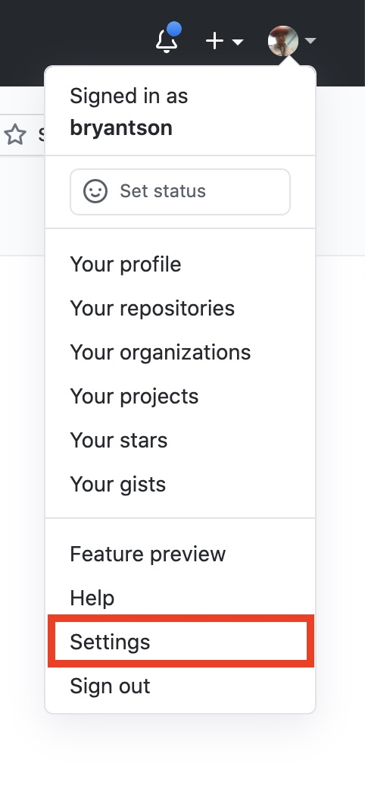
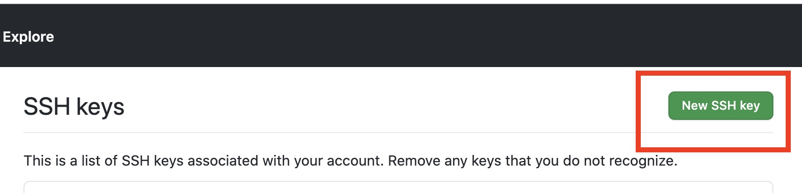
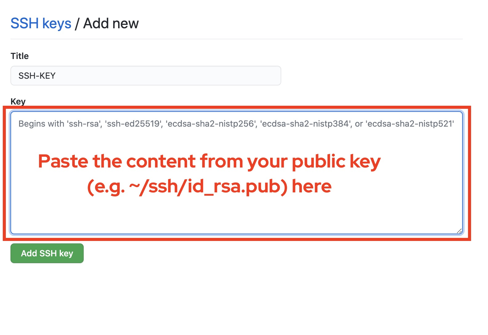

# FAQ 

This section documents some of commonly asked questions.

Q1: How to generate a base64 encoded text?

A1: Although you can use a third party tool, many Linux & Mac environments already include **base64** command. Run the following command to convert a text to base64.

```sh
$ echo -n "YOUR TEXT TO BE CONVERTED TO BASE64" | base64
```

Q2: How do I add a SSH-KEYGEN public key to GitHub?

A2: Once you generated a SSH public key and a private key pair, please follow the guide below to add the public key to GitHub.

STEP 1: Right click on top right corner under your GitHub profile picture and select **Settings**. 



STEP 2: You will be brought to your personal settings page. Click **SSH and GPG keys**


STEP 3: Create new SSH key by clicking **New SSH key** button



STEP 4: Paste the content from your public key. For example, if your public key is in **~/.ssh/id_rsa.pub**, paste the content here. Save by clicking **Add SSH key**

